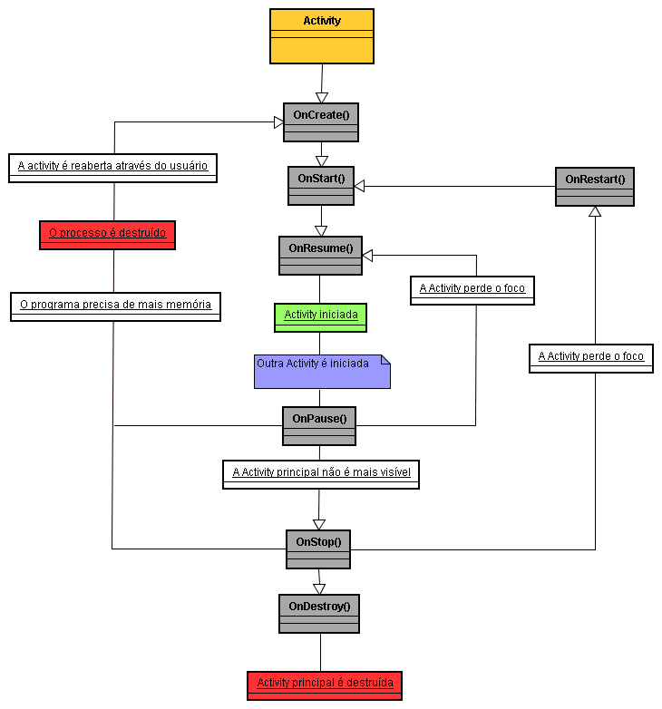
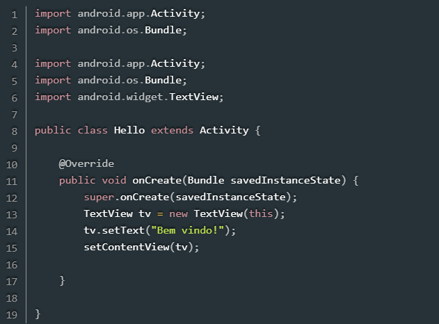
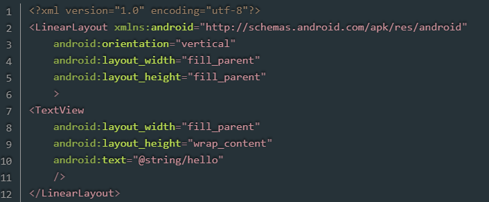
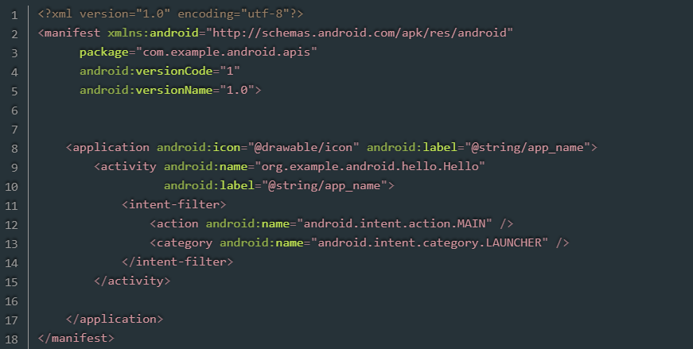
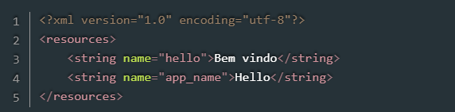

# A aplicação Android e o Ciclo de Vida da Activity

## Integrantes:
 - **Leonardo dos Santos**
 - **Daniele Barbosa**
 - **Celso Gabriel**

   
## O que é uma Activity no Android?
- Activity no android é uma tela com uma interface de usuário, que permite experiências ao usuário e interatividade.
- Podemos citar como exemplo uma tela de e-mail, que pode contar a listagem de e-mails recebidos.

## Fluxograma de um Ciclo de Vida da Activity

## Entenda como é Ciclo de Vida de uma Activity
-  O ciclo de vida de uma Activity pode ser considerado como um conjunto de callbacks onde permite que as Activity saibam que seus status estão mudando.
-  Esses callbacks fazem com que a Activity tenha a oportunidade de se comportar de maneira apropriada quando o usuário entra e sai de um aplicativo.
- Sabendo disso, podemos citar como os principais Callbacks e estados que as activity podem existir como sendo:

## 'onCreate()' 
- É um método da classe ACTIVITY, na qual chamamos quando estamos criando uma atividade, sendo assim um dos primeiros métodos a serem execultados no ciclo de vida de uma Activity.
 - Para ultilizar este método primeiro temos que configurar a interface do usuparo, onde é o local que definimos o layoute da atividade, podemos usar o " setContentView() ", após isto iniciamos os componentes da interface do usuário, podemos usar os métodos como " findViewById() ".

 ## 'onStart()'
 - Esse callback é invocado quando a Activity sai do estado de interrompida (onStop()) e volta a ser utilizada.
 - Esse método é executado rapidamente e, finalizada essa etapa, a Activity passa para o próximo estado, em que estará pronta para realizar os processos de interação com quem vai utilizar o aplicativo.

 ## 'onResume()'
 - É o que efetivamente deixa o aplicativo pronto para uso, permitindo interação com as pessoas usuárias. É nesse estado, chamado de em retomada, que o aplicativo também consegue ativar qualquer funcionalidade que precise operar enquanto estiver sendo utilizado, por exemplo, a inicialização da câmera.
 - Nesse estado, a Activity fica na parte superior da pilha de navegação e captura toda interação que a pessoa usuária faz. O aplicativo ficará nesse estado até acontecer uma ação que saia da tela, como acessar outra Activity ou fechar o app.

 ## 'onPause()'
 - Quando acontece uma mudança de foco de atenção, ou seja, quando ocorre alguma sobreposição ao aplicativo atual, como, receber uma ligação, por exemplo, a Activity entra em estado de pausada.
 - Esse estado é um primeiro indicador de que a Activity não está 100% em foco para a pessoa usuária. Porém, o aplicativo ainda não foi fechado, e pode ser visualizado no modo de exibição de múltiplas janelas.

 ## 'onStop()'
 - Quando a Activity fica completamente invisível para a pessoa usuária, o sistema chama o callback onStop() e passará ao estado interrompido.
 - Nesse estado, o aplicativo irá liberar ou ajustar mais recursos que não precisam estar disponíveis enquanto a Activity não estiver visível para a pessoa usuária, por exemplo, pausar animações e exibir itens menos detalhados. Porém, onStop permite ainda a visualização do aplicativo no modo de múltiplas janelas.

 ## 'onRestart()'
 - Esse callback é invocado quando a Activity sai do estado de pausado (onPause()) ou de interrompido (onStop()) e volta a ser utilizada. O onRestart() sinaliza que a Activity está sendo iniciada novamente e restaura seu estado a partir do momento que foi interrompida.
 - O método onRestart() é sempre seguido do onStart(), iniciando novamente o ciclo.

 ## 'onDestroy()'
 - O método onDestroy() é chamado quando a Activity será destruída e isso pode acontecer devido ao fato de a pessoa usuária descartar completamente o aplicativo, ou então quando ocorre alguma mudança de configuração como a rotação da tela.
 - Se o aplicativo for fechado, o onDestroy() será o callback final do ciclo de vida. Porém, caso tenha sido chamado devido a uma mudança de configuração do sistema, criará automaticamente uma nova instância da Activity e chamará o método onCreate() para essa nova configuração.
 - Todos esses métodos estão implicitos à criação da activity, no entanto podem ser reescritos utilizando a anotação @Override e a chamada ao método principal.

## Abaixo um exemplo de classe Activity:
- Na imagem abaixo temos a importação da Activity, na qual é a base para todas as atividades android, a classe Bundle que usamos para passar dados entre as atividades e em seguida a classe TextView, na qual é um widget de interfade do usuário para exibir o texto.
Após as importações definimos a classe, nesse caso a classe Hello, que se orna uma atividade do andrid. 
- Temos o @Override indicando que sobrescrevemos o médoto 'OnCreate' da classe 'Activity'. 
chamamos o método 'public void onCreate (Bundle savedInstanceState)' quando a atividade for criada, em seguida chamamos o método OnCreate da superclasse Activity e realizamos assim a inicialização padrão. Na parte do TextView tv é onde criamos o texto a ser exibido que neste caso foi definido como "Bem vindo".

   

- Nesta segunda imagem temos a declaração do xml e sua versão, apois isto temos o Layout. 
um contêiner que oganiza seus filhos numa unica coluna. Neste caso utilizando 'Vertical' para organizar, o xmlns deve o nameespace padrao atribuidos do android. O fill parente faz o layout ocupar toda largura do pai, assim como altura também.
- No TextView o widget da interface do usuário exibie o texto e o @string/hello define o texto a ser exibido.

   
- Este código XML é o arquivo de manifesto (AndroidManifest.xml) de um aplicativo Android. O manifesto é um arquivo essencial para qualquer aplicativo Android, pois ele fornece informações sobre o aplicativo ao sistema Android.
- Este arquivo de manifesto define as configurações básicas e os componentes do aplicativo. 

   
- Este código XML define strings de recursos para um aplicativo Android. Ele faz parte dos arquivos de recursos que permitem a internacionalização e a fácil manutenção de texto dentro do aplicativo.
- Essa abordagem de usar arquivos de recursos para strings permite fácil tradução e manutenção, pois todas as strings do aplicativo ficam centralizadas em um único local, tornando simples a localização e a modificação do texto sem precisar alterar o código ou o layout diretamente.

   

## Exemplo com a classe 'Activity' completa:

    public class HelloActivity extends Activity {

    private static final String TAG = "Olá mundo";  // Define uma constante para mensagem de log

    @Override
    protected void onCreate(Bundle savedInstanceState) {
        super.onCreate(savedInstanceState);  // Definilção do layout da atividade pelo arquivo xml
        setContentView(R.layout.activity_hello); 

        TextView tv = findViewById(R.id.text_view_hello); // Inicializa o TextView a partir do layout
        tv.setText("Bem-vindo!"); // Define o texto que sera exibido
        
        Log.d(TAG, "onCreate() called"); // Registrando uma mensagem de log para iniciar o método onCreate 
    }

    @Override
    protected void onStart() {
        super.onStart();   // Registra de uma mensagem de log indicando que o método onStart
        Log.d(TAG, "onStart() called");
    }

    @Override
    protected void onResume() {
        super.onResume();  // Registra uma mensagem de log indicando que o método onResume
        Log.d(TAG, "onResume() called");
    }

    @Override
    protected void onPause() {
        super.onPause(); // Registra uma mensagem de log indicando que o método onPause
        Log.d(TAG, "onPause() called");
    }

    @Override
    protected void onStop() {
        super.onStop(); // Registra uma mensagem de log indicando que o método onStop 
        Log.d(TAG, "onStop() called");
    }

    @Override
    protected void onDestroy() {
        super.onDestroy(); // Registra uma mensagem de log indicando que o método onDestroy 
        Log.d(TAG, "onDestroy() called");
    }
}

## **Considerações Finais**

Cada um desses pontos são importantes pois permitem que você gerencie como sua aplicação se comporta, sem excessão. Acontece que a 'Activity' não é algo totalmente estático durante seu funcionamento, devido ao fluxo de dados, a mesma é submetida a funções (ou métodos) que influenciam em seu funcionamento em determinada etapa. 

O maior proveito que pode-se ser tirado de um ciclo de vida de uma Activity recai sobre o uso devido de cada um dos seus respectivos métodos. Entre os beneficios pode ser citado a opção de salvar e restaurar o estado da Activity, garantindo que os dados não sejam perdidos durante mudanças de configuração ou interações com o usuário e que a aplicação responda de forma dinâmica às interações do usuário, como por exemplo, igual a "pausar um vídeo" quando a Activity própria é pausada. A pessoa estar mais imersa e no controle do funcionamento da lógica de seu código é muito importante. 

Vale ressaltar que os métodos do ciclo de vida mencionados não são exclusivos do Kotlin; eles fazem parte da estrutura de desenvolvimento Android e estão presentes em outras linguagens suportadas para Android, como Java.
